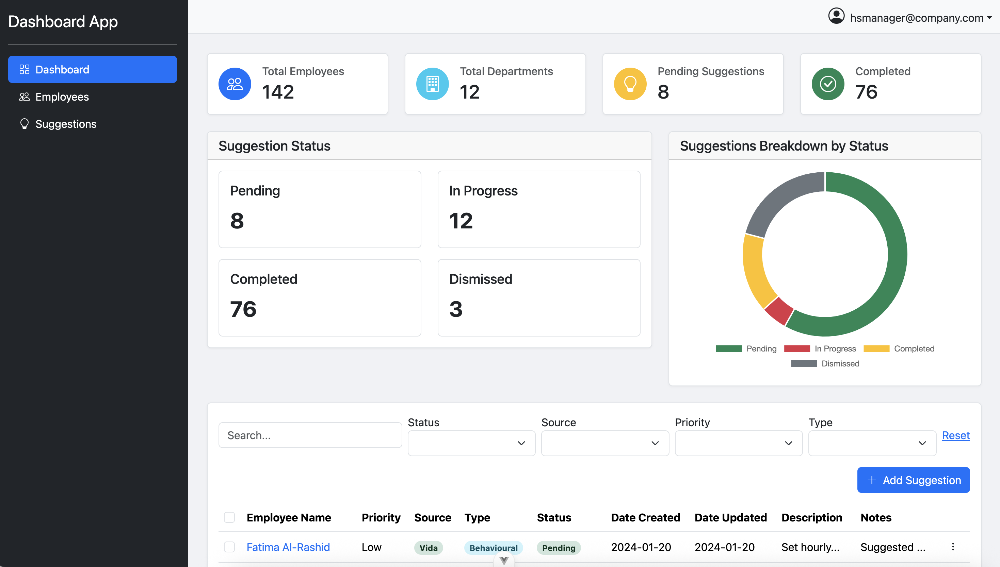

## Project Readme: Vitrue Health Full Stack Developer Task Submission

This document outlines the setup, execution, and key details of the project submitted for the Task. The project comprises a **Vue.js frontend** and a **.NET backend API**.


---

## 🚀 Getting Started

The project can be run in two primary ways: manually or using Docker Compose.

### 🛠️ Prerequisites

Before running the project, ensure you have the following installed:

* **.NET SDK** 8.0+
* **Node.js** and **npm** or **yarn** 22.14.0
* **Docker** and **Docker Compose** 3.8

---

## 💻 Manual Execution

Follow these steps to run the frontend and backend applications separately on your local machine.

### 1. Backend (.NET API)

1.  **Navigate** to the backend project directory `src/apps/suggestions-dashboard-backend/Suggestions.API`
2.  **Restore** dependencies:
    ```bash
    dotnet restore
    ```
3.  **Build** the project:
    ```bash
    dotnet build
    ```
4.  **Run** the API:
    ```bash
    dotnet run
    ```
    The API should start and typically run on a port like `http://localhost:5104` or `http://localhost:5001` (HTTPS). Check the console output for the exact address.

### 2. Frontend (Vue.js)

1.  **Navigate** to the frontend project directory (e.g., `src/apps/suggestions-dashboard`).
2.  **Install** dependencies:
    ```bash
    npm install
    # or
    yarn install
    ```
3.  **Run** the development server:
    ```bash
    npm run dev
    # or
    yarn dev
    ```
    The Vue application will compile and open in your browser, usually at `http://localhost:5173` or similar.

---

## 🐳 Docker Compose Execution

Use Docker Compose to build and run both services in isolated containers.

1.  **Ensure** Docker is running on your machine.
2.  **Navigate** to the root directory where the `docker-compose.yml` file is located.
3.  **Execute** the following command to build the images and start the containers:
    ```bash
    docker compose up --build -d
    ```
    * The `--build` flag ensures fresh images are built.
    * The `-d` flag runs the containers in **detached mode** (in the background).
4.  **Access** the application:
    * The **Frontend** should be accessible at `http://localhost:3000` (check your `docker-compose.yml` for the exact exposed port).
    * The **Backend API** will be running internally and exposed to the frontend, but might also be accessible externally at `http://localhost:3001`.
5.  **Stop** and **remove** the containers when finished:
    ```bash
    docker compose down
    ```

---

## Logging Into the Application
Users can login into the dashboard using the test credentials below
- username: 'hsmanager@company.com', email: 'hsmanager@company.com', passwordHash: 'password123'
- username: 'test@company.com', email: 'test@company.com', password: 'password123'

---

## 💡 Project Details and Discussion

This section provides insights into the design, architecture, and current status of the project.

### Architectural Overview

* **Frontend (Vue.js):** Utilizes a modularised project structure with modules containing views , services , routing and components. Components are responsible for presentation and state management. The frontend communicates with the backend via **HTTP requests** (e.g., using `fetch` or `axios`).
* **Backend (.NET):** Implemented as a **RESTful API** using **ASP.NET Core Minimal APIs**. The design follows a **Vertical Slice architecture** to separate features. This approach promotes maintainability and testability.

### Key Assumptions

| Assumption | Rationale |
| :--- | :--- |
| **API Port** | Assumed the backend will run on the standard development port specified in the `launchSettings.json` or within the `Dockerfile`/`docker-compose.yml`. |
| **Data Persistence** | For the task submission, the backend uses an **in-memory storage** (e.g., a simple list or mock service) instead of a dedicated database. *If a database is used, the necessary connection strings must be configured.* |
| **Security** | Basic **CORS** (Cross-Origin Resource Sharing) is configured on the backend to allow requests from the frontend's development URL (`http://localhost:3000`, etc.). Production-level authentication/authorization is *not fully implemented*. |
| **Suggestion Status Update** | Users cannot change the status of suggestions that are either completed or dismissed. Validation of data occurs in the frontend and user is notified. |

### Design Choices

* **Technology Stack:** **Vue.js** was chosen for its reactive nature and simplicity in creating a single-page application (SPA). **.NET** was selected for the backend for its robust performance, scalability, and familiarity.
* **UI Libraries:** **Bootstrap** was chosen for quick prototyping. Bootstrap classes were used to achieve responsiveness of mobile and web viewports.
* **Decoupled Services:** The frontend and backend are completely separate projects. This **decoupling** allows for independent deployment, scaling, and technology choices for each service.
* **Dockerization:** Using **Docker Compose** simplifies the deployment process, ensuring the environment is consistent across different machines, which is crucial for a submission review.

### 🚧 Completed Features
* **Seeding of Backend Data with Sample Data** 
* **Basic Authentication and Login Functionality** 
* **Dynamic Filtering of Suggestions and Employees Data Presented In Tables** 
* **Bulk Operations such as Selection, Export** 
* **Creating and Updating of Suggestion** 


### 🚧 Uncompleted Features and Areas for Improvement

* **Comprehensive Error Handling:** 
* **Unit and Integration Tests:**  **Adding unit tests** for business logic in the backend services and component tests in the frontend is essential for a production-ready application.
* **Database Integration:** Since an in-memory storage is used, the next step is to integrate a persistent database ( PostgreSQL) and implement a **migration strategy** (e.g., using Entity Framework Core).
* **Security Implementation:** Full **authentication** (e.g., JWT) and **authorization** need to be added to secure the API endpoints. Integration with Identity Server or Keycloak as an OIDC provider for login.
* **Refactoring Components In FrontEnd:** Splitting of Components such as SuggestionView and EmployeesView components into smart and dump components , to allow reusability of shared funcionality. In addition , The Employee Detail Page has not been completed.
* **Server Side Query Caching:** 
* **Dashboard Aggregation and Summary API Implementation and Frontend Integration:** 